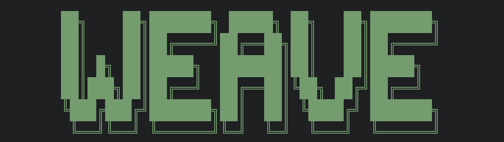

# weave



An interactive Terminal User Interface (TUI) for [Microsoft Fabric CLI](https://microsoft.github.io/fabric-cli/) built with [INK](https://github.com/vadimdemedes/ink).

## Prerequisites

- Node.js 16.0.0 or higher
- [Microsoft Fabric CLI (`fab`)](https://microsoft.github.io/fabric-cli/) installed and configured (fab auth login)
- Authenticated Fabric session

## Installation

### Option 1: Homebrew (Recommended)

Install directly from the custom tap:
```bash
brew tap marhaasa/tools
brew install weave
```

### Option 2: From Source

1. Clone this repository:
   ```bash
   git clone https://github.com/marhaasa/weave.git
   cd weave
   ```

2. Install dependencies:
   ```bash
   npm install
   ```

## Running weave


### If installed via Homebrew:
```bash
weave
```

### If installed from source:

Start the application using npm:
```bash
npm start
```

Or run directly with Node.js:
```bash
node weave.js
```

## Features

- **Interactive Workspace Browser**: Navigate through your Fabric workspaces
- **Notebook Management**: Run notebooks asynchronously or synchronously
- **Job Monitoring**: Track job status and completion (notebooks only)
- **Command History**: View previously executed commands
- **Interactive Shell**: Access the native Microsoft Fabric CLI when needed

## Usage

1. **Main Menu**: Use arrow keys to navigate, Enter to select
2. **Workspaces**: Browse and select from available workspaces
3. **Notebook Actions**: 
   - Run notebooks in background
   - Run synchronously with real-time status
   - View job details and history
4. **Navigation**: Use 'q' or ESC to go back, 'r' to refresh lists

## Keyboard Shortcuts

- `↑/↓` - Navigate menus
- `Enter` - Select option
- `q` or `ESC` - Go back/Exit
- `r` - Refresh (where applicable)
- `c` - Clear command history (in history view)

## Unreleased features

- Management of other types of resources
- Moving resources between workspaces
- and more...
